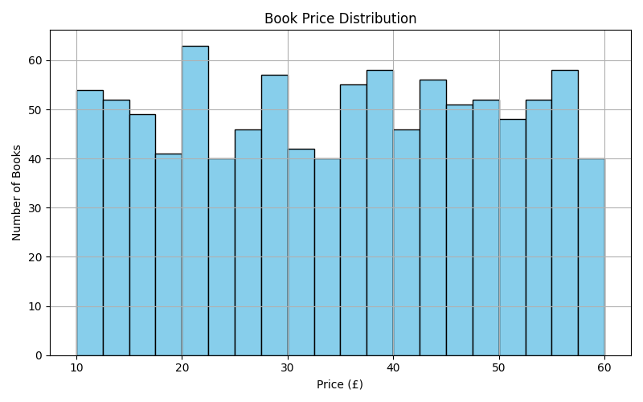

# 📚 Book Scraper & Price Analysis

This project scrapes book data from [books.toscrape.com](http://books.toscrape.com), cleans and analyzes the data, and visualizes book prices using a histogram. It was built as part of the CodeAlpha web scraping project.

---

## 🔍 Features

- ✅ Web scraping using **BeautifulSoup**
- ✅ Extracted data: **Title**, **Price**, **Availability**, and **Rating**
- ✅ Cleaned and converted prices to numeric format
- ✅ Plotted histogram of book price distribution using **matplotlib**
- ✅ Identified:
  - 🔝 Top 10 most expensive books
  - 🪙 Top 10 cheapest books
- ✅ Exported cleaned data to **CSV** and **Excel**
- ✅ Saved chart as an image

---

## 🛠️ Technologies Used

- **Python 3.x**
- **BeautifulSoup** – Web scraping
- **Requests** – Fetching HTML content
- **Pandas** – Data manipulation and cleaning
- **Matplotlib** – Data visualization

---

## 📦 Installation & Setup

1. Clone the repository:
   git clone https://github.com/your-username/your-repo-name.git
   cd your-repo-name
## 📊 Output Preview

Here’s a sample visualization of the price distribution:

